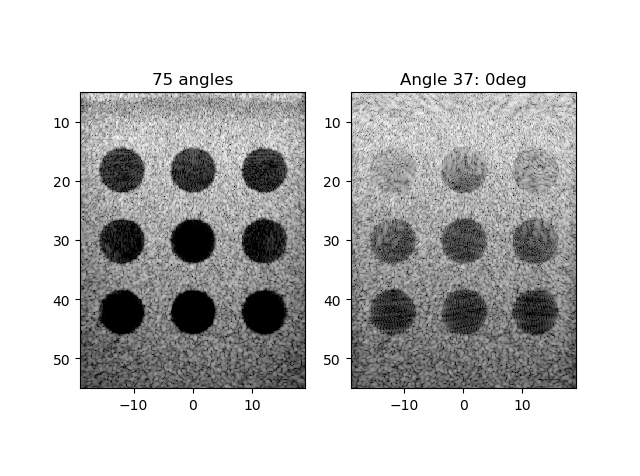

# CUBDL - Challenge on Ultrasound Beamforming with Deep Learning

## Description

This repository is for the IEEE 2020 International Ultrasonics Symposium [Challenge on Ultrasound Beamforming with Deep Learning](https://cubdl.jhu.edu/). Example python starter code is provided to demonstrate the input data format and the metrics.

If you use this code, please cite the following two references:
 
1. MAL Bell, J Huang, D Hyun, YC Eldar, R van Sloun, M Mischi, “Challenge on Ultrasound Beamforming with Deep Learning (CUBDL)”, Proceedings of the 2020 IEEE International Ultrasonics Symposium, 2020. [[pdf]](https://cubdl.jhu.edu/wp-content/uploads/2020/09/IEEE_IUS_CUBDL_Paper_2020.pdf)
2. “Challenge on Ultrasound Beamforming with Deep Learning (CUBDL)”, IEEE Dataport, 2019. [Online]. Available: http://dx.doi.org/10.21227/f0hn-8f92
 
We are also planning to release updated CUBDL evaluation code and integrated CUBDL-related datasets with the publication of a journal paper. Stay tuned for more details!

## Input data format

During testing, we will provide the user with an object describing the acquisition, as well as a pixel grid to be reconstructed.

### Plane wave acquisition description

A description of the plane wave acquisition will be provided as a `PlaneWaveData` object `P` with the following attributes:

- `idata` - A 3D numpy array of the real component of the raw channel signals for a plane wave acquisition. The dimensions can be described as

  - Python: `nangles, nelements, nsamples = idata.shape`
  - MATLAB: `[nsamples, nelements, nangles] = size(idata);`

  The MATLAB expression is provided only as reference. Testing will be performed in python. Note that `idata` can be either RF-modulated or demodulated (baseband), as determined by the `fdemod` parameter listed below.
- `qdata` - A 3D numpy array for the quadrature component of `idata`.
- `angles` - A 1D numpy array of shape `[nangles,]` of the transmitted plane wave angles in radians.
- `fc` - The center frequency of the transmitted RF waveform.
- `fs` - The sampling frequency of the acquisition.
- `c` - The nominal speed of sound to be used for reconstruction.
- `time_zero` - A 1D numpy array of shape `[nangles,]` listing the time considered to be **time zero** for the purposes of image reconstruction on a per-transmission basis.
- `ele_pos` - A 2D numpy array of shape `[nelements, 3]` describing the azimuthal, elevation, and depth coordinates of each element.
- `fdemod` - The frequency of demodulation applied to the raw data. It is often desirable to demodulate the data prior to focusing to lower the Nyquist frequency (i.e., require sufficient sampling with respect to the bandwidth, rather than the center frequency plus bandwidth). In the case that no demodulation is applied (i.e., the data is still modulated), `fdemod = 0`.

### Beamforming pixel grid

The desired pixel grid to be reconstructed is specified as

- `grid` - A 3D numpy array with dimensions

  - Python: `ncols, nrows, 3 = grid.shape`
  - MATLAB: `[xyz, nrows, ncols] = size(grid);`.

## Example delay-and-sum code



Simple examples of plane-wave delay-and-sum beamforming is provided in [das_torch.py](das_torch.py) and in [das_tf.py](das_tf.py). The example code depends on the following packages:

- `numpy`
- `scipy`
- `matplotlib`
- `tqdm`
- `h5py`

Anaconda is recommended for managing Python packages.

To run the PyTorch DAS example on a CUDA-enabled GPU, create a conda environment with

```shell
conda create -n cubdl python=3 pytorch torchvision cudatoolkit=10.1 -c pytorch
```

To run the TensorFlow example on a CUDA-enabled GPU, create a conda environment with

```shell
conda create -n cubdl python=3 tensorflow-gpu=2
```

The remaining packages can be added by activating the environment and installing the desired packages, e.g.,

```shell
conda install -n cubdl numpy scipy matplotlib tqdm
```

The code is auto-formatted with the `black` formatter:

```shell
conda install -n cubdl black rope pylint -c conda-forge
```

## Metrics

Some of the evaluation metrics have been included in [metrics.py](metrics.py). Note that no regions of interest (ROI) are provided; the ROIs will be selected on a per-dataset basis in the test data.

### Within-Image Metrics

Below, $`\mu_i`$, $`\sigma^2_i`$, and $`f_i`$ denote the mean, variance, and histogram of ROI $`i`$.

```math
\mathrm{Contrast} = \frac{\mu_1}{\mu_2}
```

```math
\mathrm{CNR} = \frac{\mu_1-\mu_2}{\sqrt{\sigma^2_1 +\sigma^2_2}}
```

```math
\mathrm{gCNR} = 1-\sum_{x} \min\{f_1(x), f_2(x)\}
```

```math
\mathrm{SNR} = \frac{\mu}{\sigma}
```

### Cross-Image Metrics

Below, $`x`$ and $`y`$ denote two images containing $`N`$ pixels each.

```math
\ell_1 = \frac{1}{N}\sum_{n=1}^N \left| x_n - y_n \right|
```

```math
\ell_2 = \sqrt{\frac{1}{N}\sum_{n=1}^N \left| x_n - y_n \right|^2}
```

```math
\mathrm{PSNR} = 20\log_{10} \frac{\mathrm{Dynamic Range}}{\sqrt{\frac{1}{N}\sum_{n=1}^N \left| x_n - y_n \right|^2}}
```

```math
\mathrm{\rho} = \frac{ \sum_{n}(x_n-\mu_x)(y_n-\mu_y)}{\sqrt{(\sum_n |x_n-\mu_x|^2)(\sum_n |y_n-\mu_y|^2})}
```
